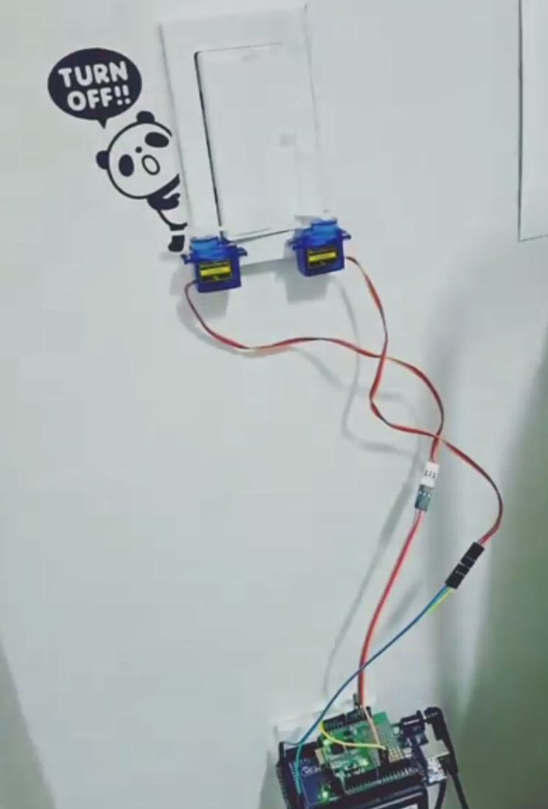

# WIFI Light controller

Arduino cord that allows the servomotor to control the light switch with WiFi.

## Required devices

- Arduino Uno
- JSN270 wifi shield
- two servo moters

## Dependency

- JSN270 driver [Download Link](https://github.com/jmpsystems/JSN270-arduino-shield)

## Hardware setup

1. Attach Wi-Fi shield to Arduino.
2. Connect the servo moter which turn off the light to pin 9.
3. Connect the servo moter which turn on the light to pin 10.
4. Attach each servo motor to the side of the switch.
5. An example image is shown below.

## Software setup

1. Change the following constants in your code.
    - SSID
    - KEY
    - AUTH
    - MY_IP
    - SUBNET
    - GATEWAY
    - SERVER_PORT

2. Upload the code to your Arduino.
3. If you want to control the lights outside the router, configure the router for port forwarding.
4. Now, you can control your lighting by connecting to the link below.
    - Turn off: http://MY_IP:SERVER_PORT/L
    - Turn on: http://MY_IP:SERVER_PORT/H
5. Also, using the [IFTTT](https://ifttt.com/)'s webhook, you can control the light with [Google Assistant](https://assistant.google.com) or [Amazon Alexa](https://www.amazon.com/Amazon-Echo-And-Alexa-Devices).

## Example of hardware setup

